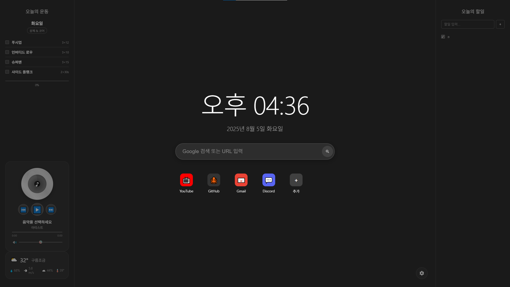

# 🌐 Chrome New Tab – 커스텀 새 탭 페이지

기존 크롬 새 탭의 단조로움을 벗어나,  
**날씨·검색·시계·할일·운동루틴** 등 다양한 정보를 한눈에 볼 수 있도록 만든 **커스텀 HTML 기반 새 탭 페이지**입니다.

---

## 📌 기능 요약

| 기능 | 설명 |
|------|------|
| 🕒 시계 & 날짜 | 현재 시간과 날짜를 중앙에 표시 |
| 🔍 검색창 | Google 검색 및 직접 URL 입력 가능 |
| 📁 즐겨찾기 | YouTube, GitHub 등 자주 쓰는 링크 바로가기 |
| 🌦 날씨 정보 | 실시간 날씨, 기온, 강수량, 풍속, 습도 등 표시 |
| 📋 오늘의 할일 | 간단한 To-Do List 추가 및 완료 체크 |
| 🏃‍♂️ 오늘의 운동 | 푸시업, 인버티드 로우 등 운동 루틴 트래킹 |
| 🎵 음악 UI | 재생/정지/볼륨 컨트롤 가능한 미니플레이어 UI (시연용) |

## 🛠 기술 스택

- **HTML5 / CSS3**
- **Vanilla JS**
- **OpenWeather API**

---

## 🧠 앞으로 할 일

- [ ] 사용자 위치 자동 감지 및 날씨 표시
- [ ] localStorage로 할일/운동/세팅 저장
- [ ] 테마 전환 (라이트/다크)
- [ ] 배경 커스터마이징 기능

---

## 📄 라이선스

MIT License  
자유롭게 사용, 수정, 배포 가능합니다.

---

## 🙋‍♂️ 만든이

**undefineusername**  